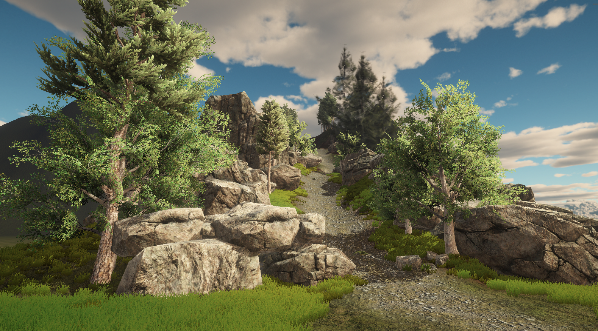
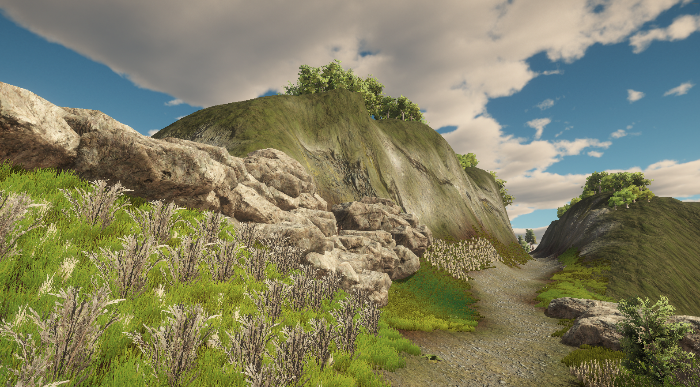
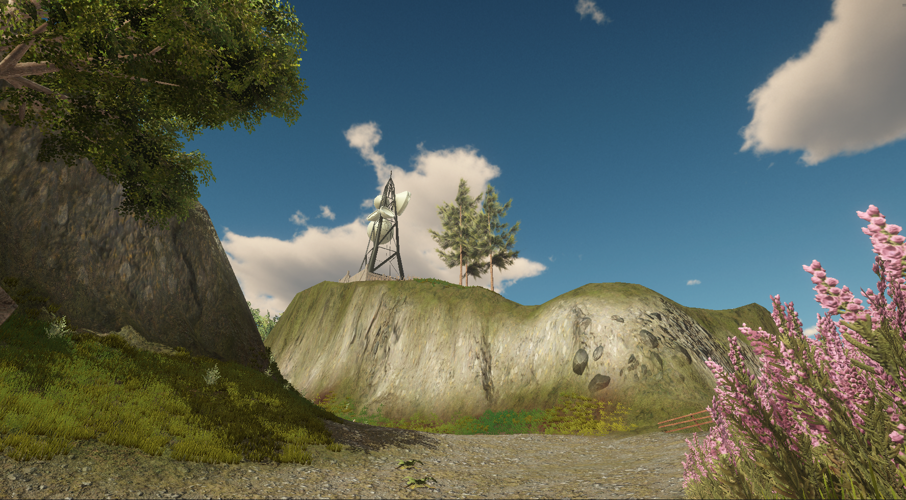
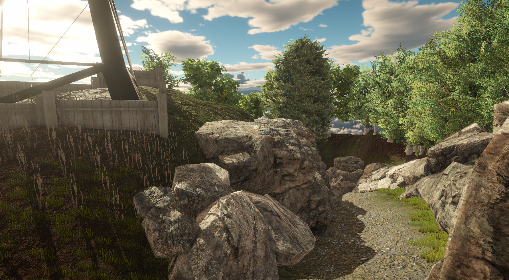

# Terrain-tools
Experimenting with Unity Terrain Tools: terrain, grass, trees along with environment using Lighting, Skyboxes, LoD Levels and Textures.

Checkout the .mp4 file for complete walkthrough

Screenshot 1:

Screenshot 2:

Screenshot 3:

Screenshot 4:

Screenshot 5:

